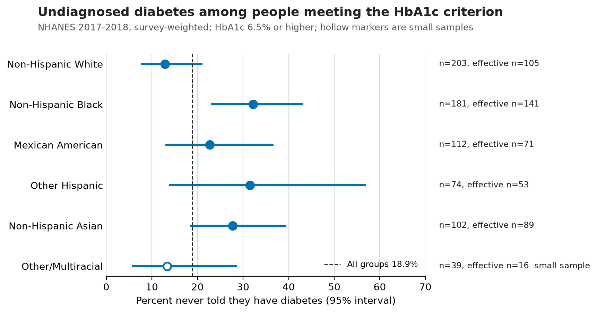
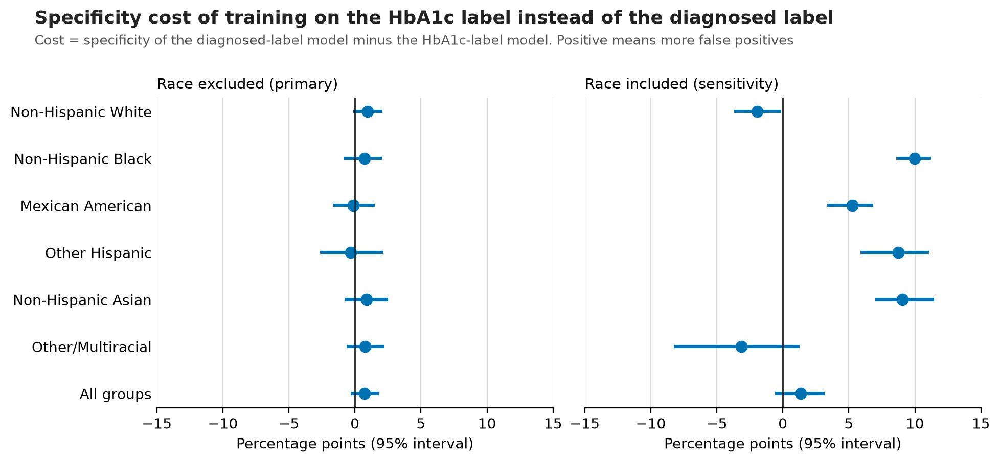
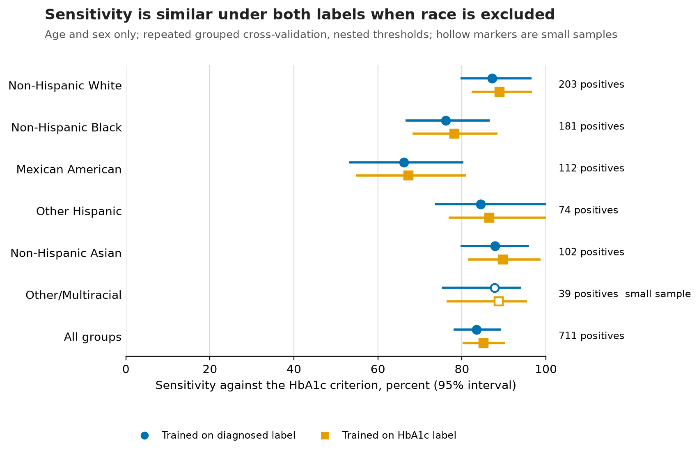

# Diabetes Care Gaps & Diagnostic Equity | NHANES 2017-2018

[](https://github.com/VijayChamakuri/diabetes-care-gaps-diagnostic-equity/actions/workflows/ci.yml)
[](LICENSE)
[](pyproject.toml)

> Survey-weighted analysis of nationally representative NHANES data that quantifies the undiagnosed diabetes gap and tests whether the choice of training label changes model performance across demographic groups.

**Decision question.** If a health system builds a diabetes screening model, does labelling patients by "a doctor told them" versus "their HbA1c meets the ADA criterion" change who the model misses and who it over-flags?



**Dashboard:** open [`dashboard/index.html`](dashboard/index.html) in a browser (single offline file, three pages). Screenshots: [overview](dashboard/screenshots/01_care_gap_overview.png), [model tradeoffs](dashboard/screenshots/02_model_tradeoffs.png), [methods and data quality](dashboard/screenshots/03_methods_data_quality.png). This is an HTML dashboard. There is no Tableau or Power BI workbook; a Tableau data package (extracts, build guide and QA checklist, no workbook) is in [`tableau/`](tableau/README.md).

> **What this does not prove.** The undiagnosis gap is descriptive. It could reflect access to care, screening frequency, clinician behavior, insurance, or measurement, and this data cannot separate them. Nothing here shows clinician bias. The models are deliberately minimal comparisons of two labels, not clinical risk models, and are not ready for deployment. Every subgroup comparison except the one named in advance is exploratory.

## Headline findings

<!-- BEGIN generated:headline -->
1. **Undiagnosed diabetes gap.** Of 711 respondents meeting the HbA1c criterion (22.5 million people once weighted), 18.9% (15.5% to 22.8%) were never told they have diabetes. Non-Hispanic Black respondents: 32.2% (23.0% to 43.1%; n = 181, effective n = 141). Non-Hispanic White respondents: 12.8% (7.5% to 21.1%; n = 203, effective n = 105). Difference +19.4 pp (95% CI +7.0 to +31.8 pp, p = 0.004), ratio 2.51 (95% CI 1.34 to 4.69). This is the one pre-specified comparison.
2. **With race excluded, the training label barely changes the primary age-and-sex model.** AUC against the HbA1c criterion is 0.758 for the diagnosed label and 0.756 for the HbA1c label (difference +0.001, 95% CI 0.000 to +0.003, bootstrap p = 0.156). Overall specificity cost +0.7 pp (95% CI -0.3 to +1.8 pp).
3. **In this comparison the label matters when race is a model input.** With race included, the specificity cost is +10.0 pp for Non-Hispanic Black respondents (95% CI +8.6 to +11.2 pp) and -1.9 pp for Non-Hispanic White respondents (95% CI -3.7 to -0.1 pp).
<!-- END generated:headline -->

## Stakeholder artifacts

| Artifact | What it is |
|---|---|
| [Quality brief](reports/healthcare_quality_brief.md) | Two-page decision brief for care-gap monitoring. Every number is generated from `outputs/tables`. |
| [Excel quality review](excel/README.md) | Seven-sheet workbook with live reconciliation formulas, filters and warning flags. No respondent rows. |
| [Case study](docs/case_study.md) | How the methods, dashboard, workbook and brief fit together. |
| [Privacy and governance](docs/privacy_and_governance.md) | What is and is not protected here, and what a production version would need. |
| [Tableau data package](tableau/README.md) | Extracts and build guide only. No Tableau workbook exists. |
| [Implementation status](docs/implementation_status.md) | Each acceptance criterion mapped to its evidence. |

## What this means for decisions

| Audience | Metric to watch | Action | How to evaluate it |
|---|---|---|---|
| Population health team | Weighted undiagnosed share by group, with denominators | Monitor screening reach and follow-up in groups with a higher estimated undiagnosed share | Repeat the estimate on the next NHANES cycle or on local data with the same definitions |
| Analytics governance | False-positive burden and subgroup uncertainty when the label changes | Do not swap a clinical label for a biochemical one without quantifying both by group | Report the specificity cost with intervals before any label change |
| Model risk | Subgroup sensitivity, calibration and effective sample size | Require subgroup calibration, a threshold analysis and small-sample warnings before deployment; treat race as a model input only with explicit justification | Run the sensitivity analyses in this repository on the candidate model |

The observed gap is not evidence that clinicians treat groups differently.

## Data and cohort

Source: [NHANES 2017-2018](https://wwwn.cdc.gov/nchs/nhanes/continuousnhanes/default.aspx?BeginYear=2017), National Center for Health Statistics. The pipeline downloads seven public files from CDC, records source URL, retrieval date, byte size and SHA-256 in [`data/data_manifest.json`](data/data_manifest.json), checks the columns it needs, and refuses to continue if a file changed. Raw files are never committed. Every variable is described in the [data dictionary](docs/data_dictionary.md).

<!-- BEGIN generated:cohort_flow -->
| Step | Criterion | Remaining | Removed |
|---|---|---|---|
| 1 | NHANES 2017-2018 participants (DEMO_J) | 9,254 | 0 |
| 2 | Examined, with a positive MEC exam weight | 8,704 | 550 |
| 3 | Meets the minimum age | 8,704 | 0 |
| 4 | Valid diabetes questionnaire answer (yes, no or borderline) | 8,362 | 342 |
| 5 | Borderline answers handled per the analysis variant | 8,187 | 175 |
| 6 | HbA1c measured | 5,873 | 2,314 |
| 7 | Known race and ethnicity (analysis cohort) | 5,873 | 0 |
<!-- END generated:cohort_flow -->

Cohort rules live in SQL ([`sql/cohort.sql`](sql/cohort.sql)) and are checked by [`sql/data_quality.sql`](sql/data_quality.sql) and [`sql/cohort_validation.sql`](sql/cohort_validation.sql) on every run. Refused and do-not-know answers are treated as missing, never as "no".

### Undiagnosed diabetes by group

Denominator: respondents whose HbA1c meets the ADA criterion. "Never told" means they answered no to being told by a doctor that they have diabetes. Weighted denominators are population estimates; respondent counts are sample sizes. Effective n is the Kish effective sample size.

<!-- BEGIN generated:undiagnosis -->
| Group | Respondents | Weighted denominator | Effective n | Never told | 95% CI |
|---|---|---|---|---|---|
| Non-Hispanic White | 203 | 12.8 million | 105 | 12.8% | 7.5% to 21.1% |
| Non-Hispanic Black | 181 | 3.2 million | 141 | 32.2% | 23.0% to 43.1% |
| Mexican American | 112 | 2.2 million | 71 | 22.7% | 12.9% to 36.7% |
| Other Hispanic | 74 | 1.5 million | 53 | 31.5% | 13.8% to 56.9% |
| Non-Hispanic Asian | 102 | 1.6 million | 89 | 27.7% | 18.4% to 39.5% |
| Other/Multiracial (small sample) | 39 | 1.2 million | 16 | 13.3% | 5.6% to 28.7% |
| All groups | 711 | 22.5 million | 271 | 18.9% | 15.5% to 22.8% |
<!-- END generated:undiagnosis -->

Each group against the reference. Only the first row was pre-specified; the others are exploratory and carry Holm-adjusted p-values.

<!-- BEGIN generated:contrasts -->
| Group vs. Non-Hispanic White | Difference | 95% CI | Ratio | p | Holm-adjusted p | Analysis |
|---|---|---|---|---|---|---|
| Non-Hispanic Black | +19.4 pp | +7.0 to +31.8 pp | 2.51 | p = 0.004 | p = 0.022 | confirmatory |
| Mexican American | +9.8 pp | -5.9 to +25.6 pp | 1.77 | p = 0.202 | p = 0.404 | exploratory |
| Other Hispanic | +18.6 pp | -4.2 to +41.5 pp | 2.45 | p = 0.103 | p = 0.308 | exploratory |
| Non-Hispanic Asian | +14.9 pp | +2.1 to +27.7 pp | 2.16 | p = 0.025 | p = 0.102 | exploratory |
| Other/Multiracial | +0.5 pp | -10.5 to +11.4 pp | 1.04 | p = 0.927 | p = 0.927 | exploratory |
<!-- END generated:contrasts -->

Age-standardized estimates, weighted baseline characteristics and missingness by group are in `outputs/tables/`.

## Method summary

- **Design.** All estimates use the exam weight, strata and PSUs. Subgroups are subpopulations of the full design, and uncertainty is Taylor linearization with logit intervals. The full rationale, including why the fasting weight is not used, is in [docs/methods.md](docs/methods.md).
- **Models.** Two labels on identical inputs: `diagnosed` (told by a doctor) and `hba1c_pos` (meets the criterion). HbA1c is never an input. The primary models use age and sex only; race-included, extended-feature and gradient-boosting versions are sensitivity analyses.
- **Validation.** Repeated stratified cross-validation grouped by stratum and PSU, with the classification threshold chosen inside each training fold. Intervals come from a Rao-Wu rescaled PSU bootstrap.
- **Independent check.** Python estimates are compared with R's `survey` package.

## Validation and robustness

### Model comparison

Both models are scored against the HbA1c criterion. A specificity cost is the diagnosed-label model's specificity minus the HbA1c-label model's, so a positive cost means more false positives when training on the HbA1c label.

<!-- BEGIN generated:models -->
| Model | Role | AUC, diagnosed label | AUC, HbA1c label | AUC difference (95% CI) | Overall specificity cost (95% CI) |
|---|---|---|---|---|---|
| Age and sex, race excluded (primary benchmark) | primary | 0.758 | 0.756 | +0.001 (0.000 to +0.003) | +0.7 pp (-0.3 to +1.8 pp) |
| Age, sex and race dummies (sensitivity) | sensitivity | 0.763 | 0.765 | -0.002 (-0.010 to +0.005) | +1.4 pp (-0.6 to +3.2 pp) |
| Adds BMI, family history, insurance and a routine care place; race excluded | sensitivity | 0.819 | 0.819 | -0.001 (-0.006 to +0.004) | +1.6 pp (+0.2 to +3.1 pp) |
| Gradient boosting on the extended features, to test whether nonlinearity adds value | comparison | 0.811 | 0.809 | +0.002 (-0.008 to +0.013) | -2.2 pp (-3.7 to -0.8 pp) |
<!-- END generated:models -->



### Subgroup performance, primary model

<!-- BEGIN generated:subgroups -->
| Group | HbA1c positives (effective n) | Sensitivity, diagnosed label | Sensitivity, HbA1c label | Specificity, diagnosed label | Specificity, HbA1c label |
|---|---|---|---|---|---|
| Non-Hispanic White | 203 (105) | 87.2% (80% to 97%) | 88.9% (82% to 97%) | 53.1% | 52.2% |
| Non-Hispanic Black | 181 (141) | 76.1% (67% to 87%) | 78.2% (68% to 88%) | 65.9% | 65.2% |
| Mexican American | 112 (71) | 66.2% (53% to 80%) | 67.2% (55% to 81%) | 75.7% | 75.8% |
| Other Hispanic | 74 (53) | 84.5% (74% to 100%) | 86.5% (77% to 100%) | 67.4% | 67.7% |
| Non-Hispanic Asian | 102 (89) | 87.9% (80% to 96%) | 89.7% (81% to 99%) | 67.3% | 66.4% |
| Other/Multiracial (small sample) | 39 (16) | 87.8% (75% to 94%) | 88.8% (76% to 95%) | 65.6% | 64.8% |
| All groups | 711 (271) | 83.5% (78% to 89%) | 85.2% (80% to 90%) | 59.1% | 58.4% |
<!-- END generated:subgroups -->



Intervals are wide and small groups are flagged. See the [calibration figure](outputs/figures/calibration.png) and `outputs/tables/brier_by_group.csv` for calibration and weighted Brier scores by group.

### Robustness of the undiagnosis gap

<!-- BEGIN generated:robustness -->
| Analysis | Cohort | HbA1c positive | Black | White | Difference (95% CI) | Ratio | p |
|---|---|---|---|---|---|---|---|
| Main analysis | 5,873 | 711 | 32.2% | 12.8% | +19.4 pp (+7.0 to +31.8 pp) | 2.51 | p = 0.004 |
| Complete cases for extended covariates | 4,700 | 668 | 30.1% | 13.5% | +16.6 pp (+5.2 to +28.0 pp) | 2.23 | p = 0.007 |
| Borderline answers counted as diagnosed | 6,041 | 751 | 30.2% | 12.1% | +18.0 pp (+6.4 to +29.7 pp) | 2.49 | p = 0.005 |
| Borderline answers counted as not diagnosed | 6,041 | 751 | 36.5% | 17.6% | +18.9 pp (+5.3 to +32.5 pp) | 2.07 | p = 0.010 |
| Adults 18 and older only | 5,096 | 706 | 32.1% | 13.0% | +19.0 pp (+6.9 to +31.1 pp) | 2.46 | p = 0.004 |
<!-- END generated:robustness -->

### Cross-check against R

<!-- BEGIN generated:crosscheck -->
52 of 52 Python estimates match R `survey` within 1e-06 (largest absolute difference 2.6e-10). Table: `outputs/tables/r_python_crosscheck.csv`.
<!-- END generated:crosscheck -->

## Reproduce

```bash
git clone https://github.com/VijayChamakuri/diabetes-care-gaps-diagnostic-equity.git && cd diabetes-care-gaps-diagnostic-equity
uv sync --extra dev
uv run python -m nhanes_diabetes all
```

That command downloads and verifies the data, builds the cohort, runs the analysis, cross-checks against R when `Rscript` with the `survey` package is available, regenerates figures, the generated README blocks, the quality brief and the Tableau extracts, builds the Excel workbook and rebuilds the dashboard. Stages can be run alone: `download`, `build-cohort`, `analyze`, `crosscheck`, `report`, `excel`, `dashboard`. Requires Python 3.11 or 3.12 and `uv`. Fixed seeds make every table reproducible. `make test` runs lint, type checks and tests. `make check-readme` fails if the README, the quality brief, the Tableau extracts or the workbook values drift from `outputs/tables`. The workbook alone is rebuilt with `make excel`.

## Limitations and ethics

- HbA1c can read high in some people with sickle cell trait, which would overstate undiagnosis in some groups. No such variable is available.
- HbA1c is one of three ADA criteria; fasting glucose is not used.
- The models use a few coarse inputs. Extended inputs (BMI, family history, insurance, a routine place for care) come from the same survey, and access-to-care inputs are themselves part of the diagnostic process.
- Bootstrap intervals for model metrics reflect survey-design variability on out-of-fold predictions, not refitting variability.
- Small groups have wide intervals and are flagged rather than hidden. Other/Multiracial is a pooled category, not a population.
- Using race as a predictor while auditing performance by race needs explicit justification; that is why it is a sensitivity analysis here.
- This is care-gap monitoring on a public survey. It is not a certified HEDIS measure, not an analysis of EHR or claims data, and not a clinical deployment. No protected health information is involved. See [privacy and governance](docs/privacy_and_governance.md).

## Repository map

```text
src/nhanes_diabetes/   download, cohort (SQL), survey, models, metrics, plots, report, brief, workbook, tableau, dashboard, cli
sql/                   cohort, data quality, cohort validation, group summary
configs/               analysis.yml (every parameter) and metric_dictionary.yml (shared definitions)
r/validation.R         independent survey-package check
outputs/tables/        every number the README, brief, workbook and dashboard cite
outputs/figures/       PNG and SVG figures with alt text
dashboard/             offline three-page dashboard and screenshots
excel/                 seven-sheet quality review workbook and its README
reports/               generated stakeholder brief
tableau/               data extracts, field dictionary and build guide (no workbook)
scripts/               dashboard capture and workbook build
docs/                  methods, data dictionary, privacy and governance, case study, implementation status
tests/                 unit, integration and end-to-end tests on a synthetic fixture
```

## Citation

National Center for Health Statistics. National Health and Nutrition Examination Survey Data, 2017-2018. Hyattsville, MD: U.S. Department of Health and Human Services, Centers for Disease Control and Prevention. https://wwwn.cdc.gov/nchs/nhanes/continuousnhanes/default.aspx?BeginYear=2017

Code is MIT licensed. See [CONTRIBUTING](CONTRIBUTING.md).
